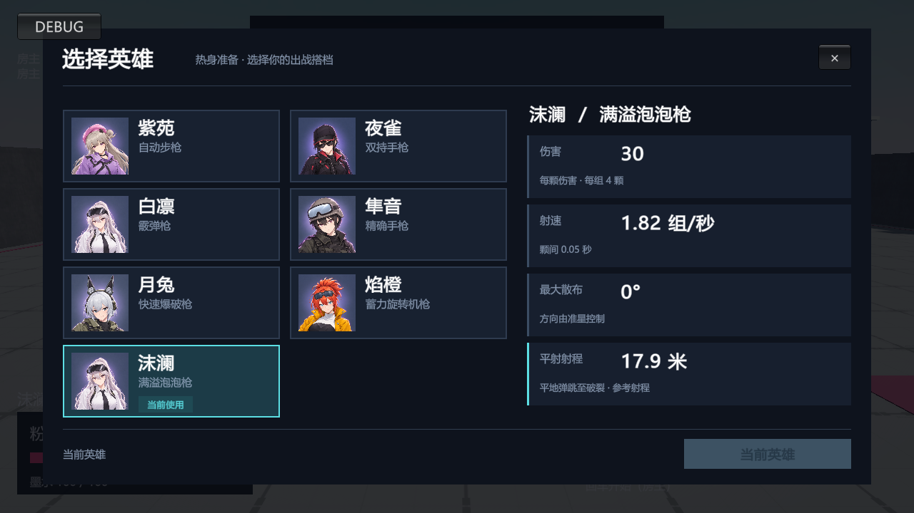
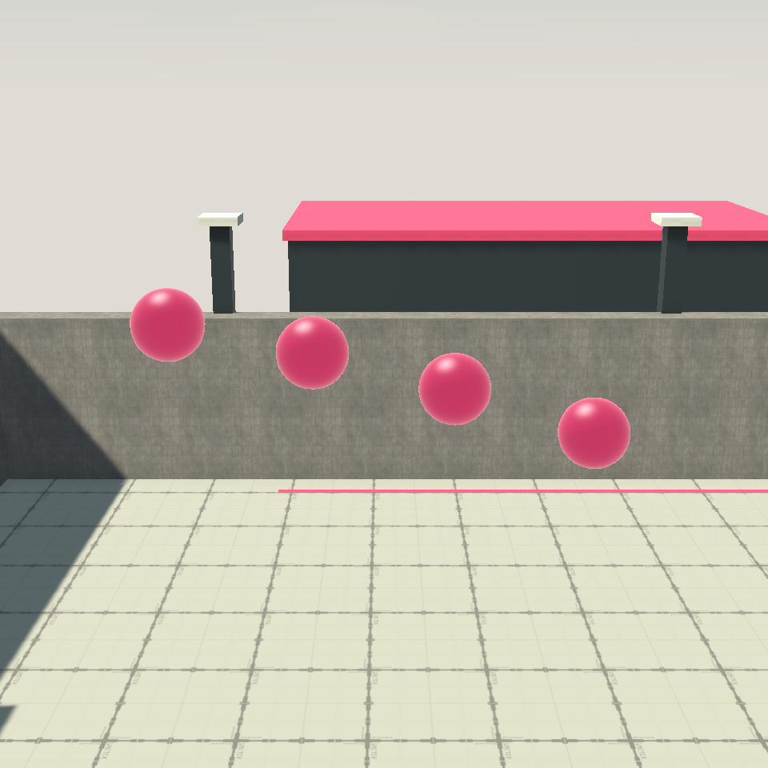
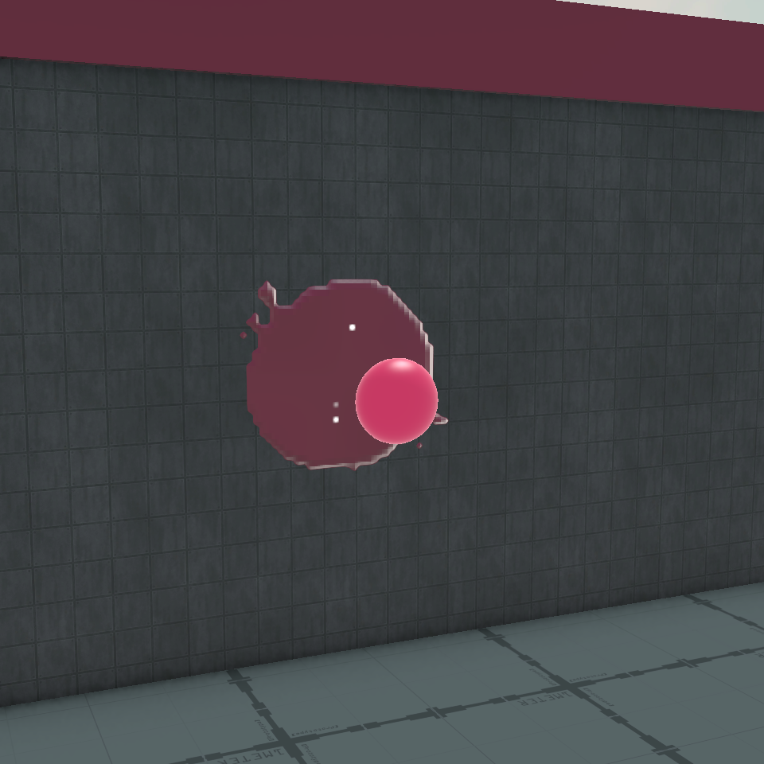
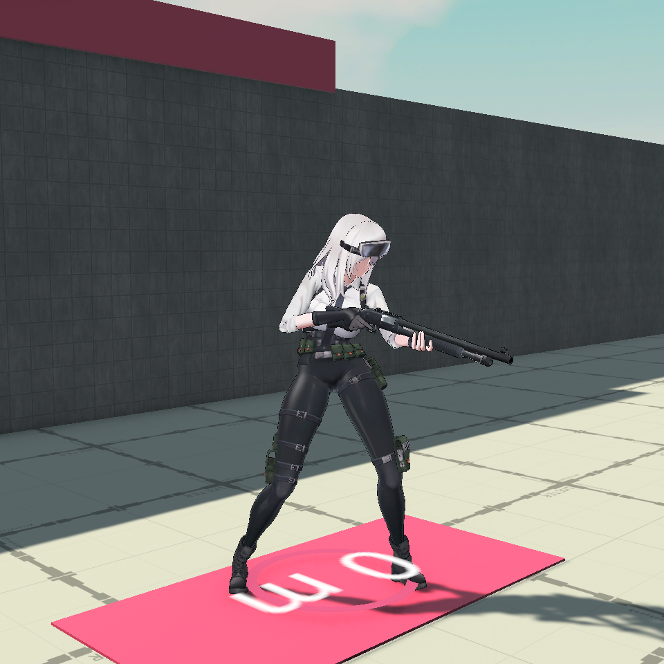

# BubbleGirl 验收记录

日期：2026-09-17。Unity 6000.3.9f1，Windows，同一 PC。实现和复现入口见 [说明](README.md)。没有将 Editor 测试等同于物理双机或目标设备验收。

## 已完成

| 层级 | 证据与结论 |
|---|---|
| 数据／资源 | 源 `TbHero.xlsx` 新增 ID 7，Luban 生成完成；`validate_weapon_assets.py --hero 7` 通过，核对源表、JSON、独立武器参数和 Addressables。七个英雄在实际 Boot 加载成功。 |
| 专项测试 | [35/35 通过](evidence/integration-tests.xml)：33 项泡泡机制／物理／表现测试、1 项真实 Host 场景测试、1 项七英雄头像注册检查；再次同步并行共享代码后复测通过。 |
| 选择界面 | [UI 场景测试通过](evidence/ui-tests.xml)：1280×720、1920×1080、2560×1080 三种分辨率实际点击并确认第七英雄。卡片改为双列四行，第七卡不再与底栏重叠；三组截图已查看。 |
| 发射 | 点击四颗、长按 0.55 s 周期、0.05 s 颗间隔、整组扣墨、缺墨不出半组、松手完成、潜墨延后、取消不退款、快照重放不重复扣墨、每颗读取当前瞄准和枪口。 |
| 碰撞 | 实际球形扫掠测试平地、30°／60° 斜面、墙面、天花板、紧角、嵌入起点；验证三次地面弹跳后破裂、累计路程与寿命。真实 Host 验证友方／自身穿过且不消耗泡泡、敌方血量 70→40→10→0、墙面反弹并涂墨。 |
| 角色／表现 | Shotgun 模型和动作复用，独立 Profile、枪械挂点和纸片 Profile 绑定通过；四颗主体、队伍色高光、墙面反弹截图已人工查看。动作按组，枪口反馈按颗。终止显示与轨迹使用同一延迟时钟，重复终止／旧弹跳包不复活弹丸。 |
| 联网 | Windows Development Player 两个独立进程、真实 NGO／UDP 传输，Host 和 Client 均 `passed=True`；客户端晚加入恢复了在途泡泡，死亡重生保留 ID 7，回合重置成功，无运行时错误。 |
| 构建 | 通过项目正式 `PrototypeBuilder.BuildWindows` 入口构建，产物位于 `D:/XPHUNITY/ProjectSplatoon_BubbleValidation/Builds/Windows/InkLan.exe`；最终大厅数值卡和七英雄布局另做增量构建。 |

平地、纯水平初速、枪口高 1.219139 m 的物理测试在 30／60／144 Hz 调用频率下，首次接触约 4.76 m，最终接触在 17.1～17.9 m 验收区间。实际逻辑枪口、站立根偏移及镜头瞄准共同计算的大厅参考值是 **17.9 m**，并已与真实碰撞模拟交叉核对，见 [数值卡输出](evidence/selection-stats.txt)。

## 网络与预算测量

[Host](evidence/host.txt)、[Client](evidence/client.txt)、[代理统计](evidence/proxy.json)。代理设置为单向 50 ms 延迟、±10 ms 抖动、1% 随机丢包；实际转发 5,549 个报文、丢弃 61 个。测试总共两名玩家，Host 约 68 秒、Client 至服务器时间约 60 秒结束。

| 指标 | Host | Client |
|---|---:|---:|
| 本地实际发射颗数（跨重生累计） | 208 | 158 |
| 收到的弹跳事件 | 1,650 | 1,563 |
| 最大可见弹丸数 | 24 | 24 |
| 服务器在途峰值 | 22 | 不适用 |
| 最大位置校正 | 0 m | 0.03 m |
| 本机进程帧时间 P95 | 8.343 ms | 8.345 ms |

Host 序列化载荷：发射／在途快照 44,978 B，命中／反射 139,012 B，实时涂墨 548,067 B，玩家增量 393,549 B。Client 输入载荷 991,524 B。这些是应用发送侧序列化计数，不包含 RPC／UDP 开销，不是网络抓包或带宽上限测量。

[8 发射者模拟微基准](evidence/simulation-budget.txt)：持续注入 10 秒、592 颗、1,640 次反射、512 次终止，在途峰值 **96**，低于主体池上限 384。最后一次测试的弹丸模拟平均 **0.3005 ms**、P95 **0.4037 ms**；弹丸事件载荷共 **214,000 B**。该测试隔离测量碰撞与轨迹，不包含 8 个真实联网角色、涂墨 GPU 或完整帧耗时，也不证明移动设备性能。

## 原有回归结果

广泛回归原始结果是 **207 项，191 通过、16 失败**，见 [失败明细](evidence/regression-summary.json)。其中 1 项六英雄固定数量断言已随新增英雄修正，独立复测通过。其余 **15 项**没有为了清绿而改变原英雄数值或放宽断言：

- 霰弹／旋转枪历史基线与当前资产不符，例如当前 Shotgun 重力 14、每颗 16、地面基础散布 5°；MachineGun 第一圈蓄力 1.5 秒、垂直散布 3°。这些两类资产与本次工作前的 Git HEAD 一致，没有被泡泡功能修改。
- Pistol、DualPistol、Rocket 的其他并行改动以及历史武器测试夹具，仍有伤害／蓄力类型断言不匹配。
- 通过项包含客户端预测、碰撞、通用弹丸模拟、弹药配置和表现、Inspector 保存／撤销及大量既有武器测试。不能将这些结果写成“原六英雄全部回归通过”。

## 仍需现场验收

- 两台物理机器和目标设备上的实际 LAN／GPU／输入体验；8 名真实客户端满员压力、完整帧耗时和抓包流量。
- 人工连续操作检查主地图台阶、高台落差、各类墙角和贴墙瞄准；现有自动化几何夹具不覆盖地图所有碰撞组合。
- 音量、湿润感、整组动画与镜头震动的主观体验。当前三段 WAV 是合成的初版出泡／弹跳／破裂音色。

## 截图

四颗泡泡是独立的表现采集夹具，放在场景上方清晰展示，并非四颗同时出膛。实际发射仍逐颗间隔 0.05 秒。

