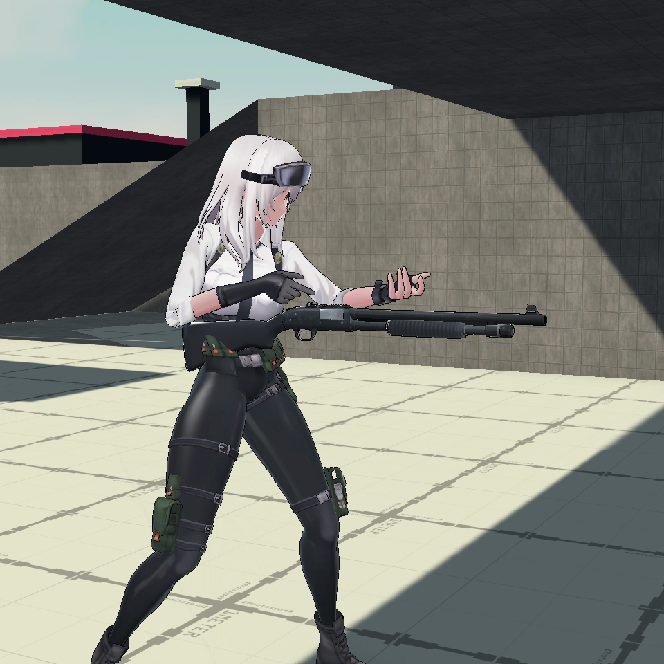
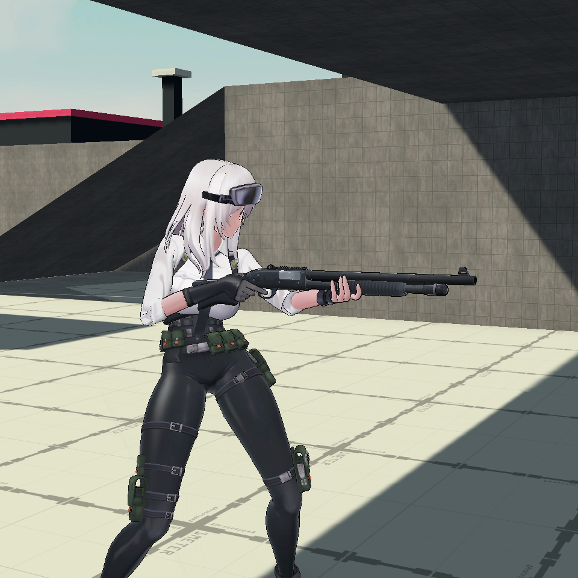
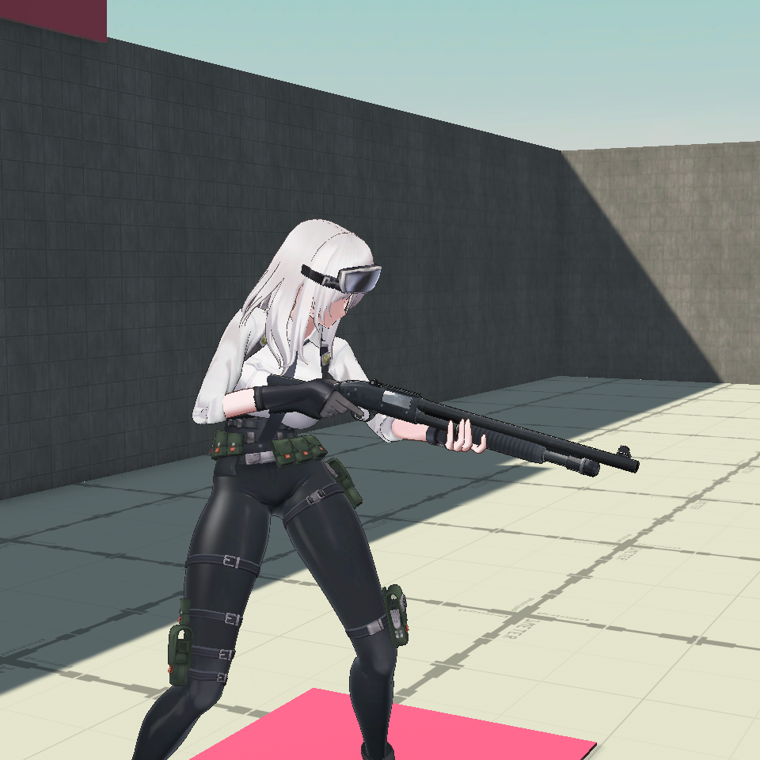
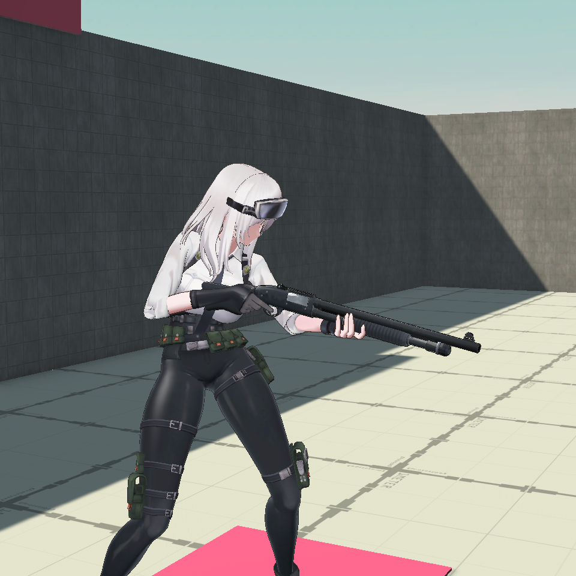
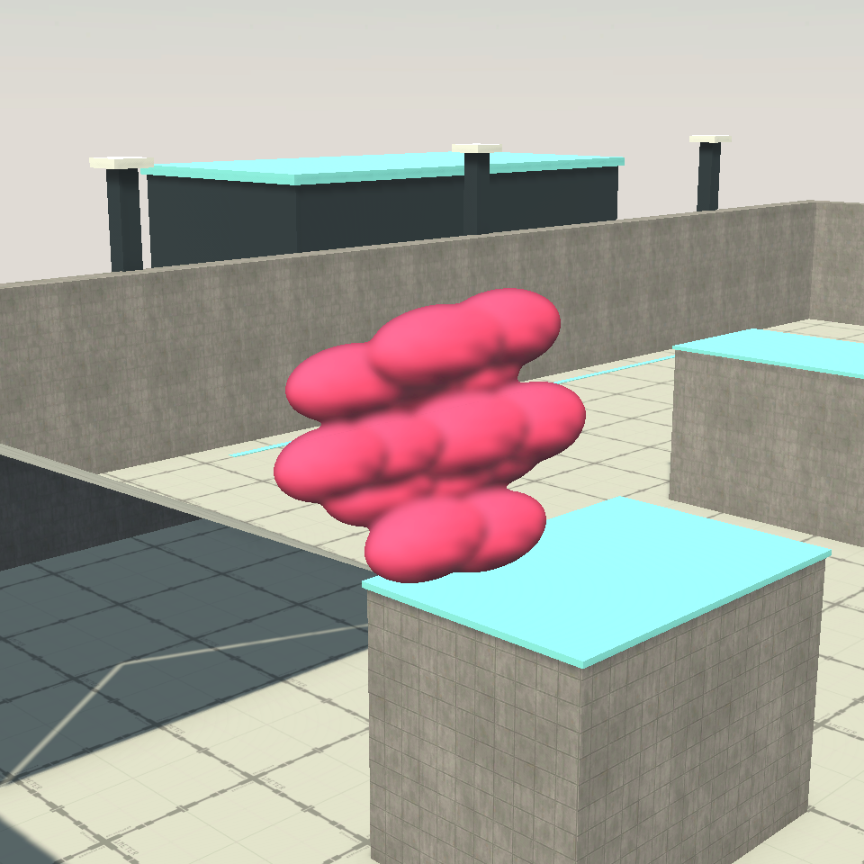
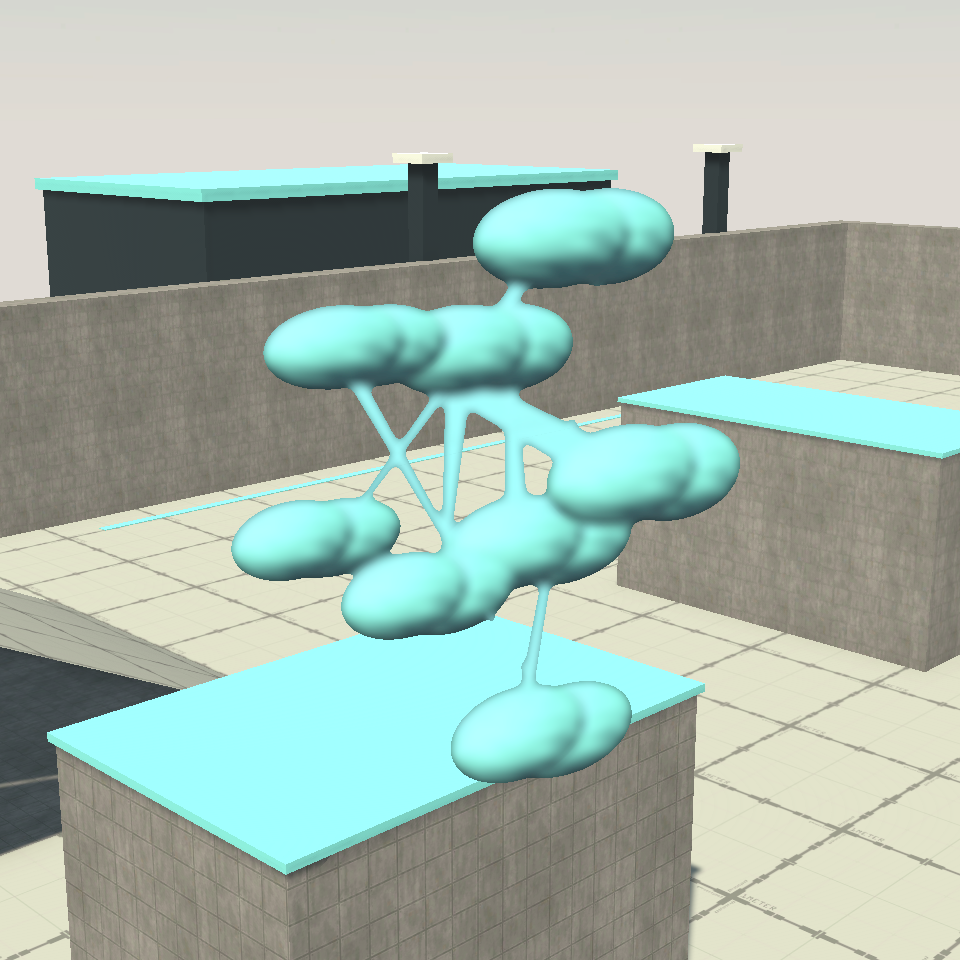

# 霰弹枪握持与飞行墨弹修复（2026-09-14）

两个问题已修复，并在 Unity 6000.3.9f1 的实际 Play Mode 房主流程中验证。验证副本位于 `D:/XPHUNITY/ProjectSplatoonValidation/WeaponRepair`，使用 D3D11、RTX 3060 和工程现有 URP 设置；没有关闭用户编辑器或创建发布包。

## 原因与修改

**霰弹枪握持错位：**创建 `Humanoid_FePistol` Avatar 时使用了 Unity 自动骨骼映射，髋部被错误映射到 `root`。源工程的显式映射使用 `pelvis`。错误映射使重定向后的身体／双手与独立动画武器骨骼产生约 12 厘米的高度差，导入工具随后将这个错误姿势固化成正式武器偏移。

构建工具现在保留源女性骨架的显式 Humanoid 描述，重新生成 FePistol Avatar 和霰弹枪的 10 个动画导入结果，再重新标定并生成正式角色、武器、控制器和表现配置。相机／瞄准支点随正确姿势降低约 0.12 米；逻辑枪口的位置保持在原测量位置，差异小于 1 微米。原四向映射、有效帧区间、材质和服装选择保留。

**飞行墨弹不可见：**权威时间原来每次 FixedUpdate 只累加固定步长，显示端则使用 NGO 的非缩放服务器时间。Unity 的最大补帧时间会丢弃长卡顿中的部分物理时间，因此两种时钟逐渐脱离。复现中暂停 1.2 秒后，新墨弹在显示端已有约 1.088 秒的年龄，接近步枪 1.2 秒寿命；偏差超过寿命时，飞行墨弹会立即被清理，权威命中和涂地仍继续。

现在在 NGO EarlyUpdate 中对齐当前帧时间，并把 Unity 固定步时间映射到相同服务器时间轴。每步移动积分仍使用原有固定步长，弹道、伤害、耗墨和射速配置未调整。最终测试主动制造 2 秒卡顿，新发墨弹年龄约 0.001 秒，之后正常显示。

另外修复了恢复当帧的绑定姿势：生成角色、重生或结束潜墨后，`Rebind()` 随即求值所选动画，避免渲染一帧手臂展开的绑定姿势。

## 验证结果

| 检查 | 结果与证据 |
|---|---|
| Unity 编译／导入 | 实际 Unity 编译、IL 后处理、资源导入与霰弹枪重建通过；[构建记录](shotgun-binding-validation.txt)。 |
| 自动测试 | **173 个用例最终全部通过**。首轮 154 通过，19 项因独立副本缺少仓库历史基线文件失败；补齐原始基线后，仅补跑受影响项目，12＋7 全部通过。[逐项结果与三批 XML](test-summary.json)。 |
| 霰弹枪 Play Mode | 待机、向下／向上瞄准、移动射击、切换英雄、潜墨中死亡与 3 秒重生通过。实际权威发射一次产生 8 颗弹丸、仅扣 4 墨，上身射击层正常播放。 |
| 五武器／两队色飞行粒子 | 10 组均经实际房主墨弹服务、RPC、粒子系统和 URP 渲染，比较开启／隐藏飞行粒子的画面，均有明确可见像素；[记录](results.txt)。使用空中测试轨迹隔离地形遮挡，保持各英雄弹道参数。 |
| 卡顿后的真实枪口发射 | 使用权威玩家状态时间与正式枪口，通过 Spawn 发射，2 秒卡顿后时钟差在一帧内且粒子可见；[时间记录](clock.txt)。 |
| 源资源完整性 | 与迁移时清单对比，源工程 794 个文件 SHA-256 全部相同；[哈希检查](source-hashes.json)。当前工程只更新所需导入元数据，没有改动源 FBX／贴图／材质。 |
| 配置与资源边界 | 五英雄与 Luban 数据不变；霰弹枪仍为半自动 8 颗／4 墨／总伤害上限 80。RifleGirl、双枪、手枪、火箭筒资源未更换，恢复当帧修复适用于所有角色。 |

本次验证覆盖单机上的真实房主与 Addressables Asset Database 加载、GPU 画面、退出和重连。**没有执行**正式 Addressables 构建、发布包、D3D12 专项、真实双机／四机、延迟丢包或四人性能验收；不把这些项目记为通过。

## 画面

同一训练场位置、相机和光照下的编辑器动画求值对照：

| 修复前 | 修复后 |
|---|---|
|  |  |

实际 Play Mode 向下瞄准与重生：

| 向下瞄准 | 重生恢复 |
|---|---|
|  |  |

实际 Play Mode 飞行霰弹（两种队色）：

| 粉队 | 蓝队 |
|---|---|
|  |  |

其余英雄的飞行画面、向上瞄准和移动射击截图也保存在本目录。

## 复跑

- 使用编辑器菜单「喷墨对战／角色／重建霰弹枪握持与骨架绑定」重新生成资源。
- 在有 GPU 的 Unity 编辑器 Test Runner 中运行 `Splatoon.Tests.WeaponPresentationPlayTests`。该测试会进入 Play Mode、创建本机房主，并主动制造一次 2 秒卡顿，因此应在测试工程执行。
- 完整测试需同时保留 `Docs/HeroMigration` 和 `Docs/WeaponAudit` 的历史基线文件。

本目录记录更新了上一轮验收中关于霰弹枪握持、恢复姿势及新增自动测试的结论；其余尚未执行的设备与联机验收仍维持原状态。
