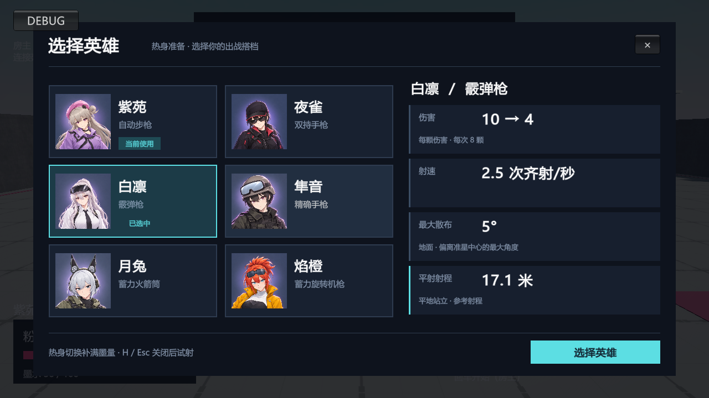
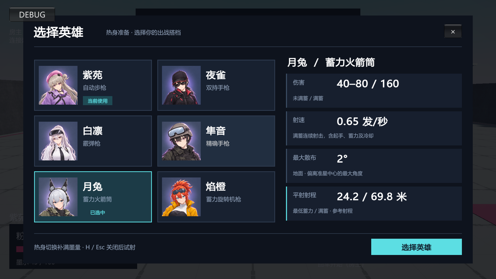
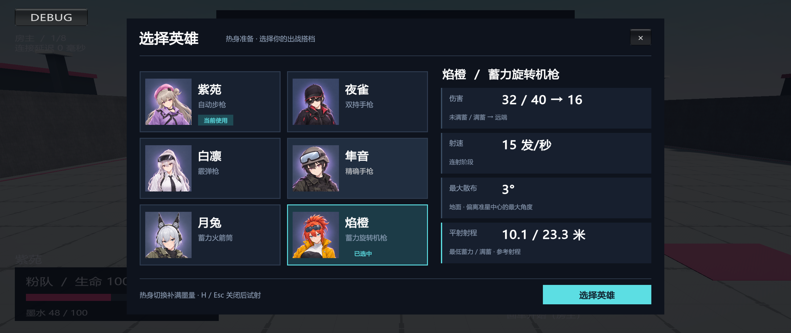

# 英雄选择界面

2026-09-15

## 已实现

- 六名英雄使用独立的插画头像，2 列 × 3 行卡片；名字和主武器类型位于头像旁。点击仅预览，确认按钮提交切换。
- 当前使用角标、青色选中边框、死亡与切换中禁用状态；保留热身补墨、调试切换保留墨量、H/Esc 返回及输入隔离。
- 右侧仅显示伤害、射速、地面最大散布和平射参考射程，移除当前英雄对比和参数滚动列表。
- 窗口采用独立等比缩放矩阵并居中。HUD 和计分板通过原有 DisplayName 消费链显示新英雄名。
- `TbHero.xlsx` 更新显示名并新增 `weaponTypeName`、`portraitAddress`，通过 `Config/Luban/gen_luban.bat` 生成强类型 C# 与 JSON。六份武器配置资源未修改。
- 1024 × 1024 PNG 头像位于 `Assets/GameResource/UI/HeroPortraits`，Unity 导入上限 512，禁用 mipmap，Clamp + Bilinear。随英雄内容加载、失败清理及离房释放，武器热更保留头像引用。

## 当前计算结果

| 英雄 | 主武器 | 平射参考射程 | 地面最大散布 |
| --- | --- | --- | --- |
| 紫苑 | 自动步枪 | 14.3 米 | 6° |
| 夜雀 | 双持手枪 | 11.1 米 | 3° |
| 白凛 | 霰弹枪 | 17.1 米 | 5° |
| 隼音 | 精确手枪 | 17.8 米 | 2° |
| 月兔 | 蓄力火箭筒 | 最低蓄力 24.2 / 满蓄 69.8 米 | 2° |
| 焰橙 | 蓄力旋转机枪 | 最低蓄力 10.1 / 满蓄 23.3 米 | 3° |

射程使用英雄表现配置中的逻辑枪口、平地站立参考根节点离地 0.04 米、准星俯仰 0°及当前无障碍远收敛距离 50 米。关闭随机散布和初速抖动，普通武器取平均初速，霰弹取固定初速，蓄力武器取对应初速。双枪分别计算左右枪口再取平均。

复用 TpsAimSolver.Geometry 与 InkBallistics.Position，计入直飞、减速、重力、碰撞半径和寿命；以弹丸球体首次接触地面的时间求枪口到落点的水平距离，不包含涂地扩散。寿命内未触地则显示寿命终点距离，并标明寿命上限。此数值不替代有效伤害射程。

射程和四项摘要按英雄缓存，同时检查武器快照、版本、枪口及相机配置和收敛距离，变化后重算。火箭筒射速显示完整满蓄循环，当前为 0.65 发/秒；旋转机枪显示连射阶段 15 发/秒；霰弹按齐射次数计速。

## 验证

最终针对性 Unity Test Runner：**70 passed / 0 failed / 0 skipped**。

- 覆盖 HeroSelectionPresentationTests、HeroMigrationTests、GameplayConfigTests、WeaponAssetTests、HeroSelectionUiPlayTests。
- 真实 InkProjectileService + Physics 平地碰撞校验覆盖六种武器、双枪左右枪口、最低蓄力及满蓄端点，计算与测量水平距离误差不超过 0.05 米。
- 验证零重力、寿命截断、缓存复用与失效、头像缺失后的资源清理与重试，以及武器更新后头像保留。
- Unity Play Mode 在 1280×720、1920×1080、2560×1080 分别通过六张头像点击预览、当前英雄禁用、热身确认补墨、死亡禁用、重生、H/Esc、调试切换保留墨量和点击不误开火检查。
- 三种分辨率截图已人工目视检查，头像比例正确、六张卡片与四项参数完整显示。
- Luban 源表与生成输出一致；原有源表单元格样式和非显示名数值保留；`git diff --check` 通过。

结果使用本机 Unity Editor 的真实 Addressables/NGO 主机流程。未执行 Windows 打包及实体双机验收。

测试 XML：`Validation/final-tests.xml`。完整运行截图与逐项日志保留于本地 `Reports/HeroSelection/`。

## 界面截图

头像生成规范及提示词见 [PortraitPrompts.md](PortraitPrompts.md)。
