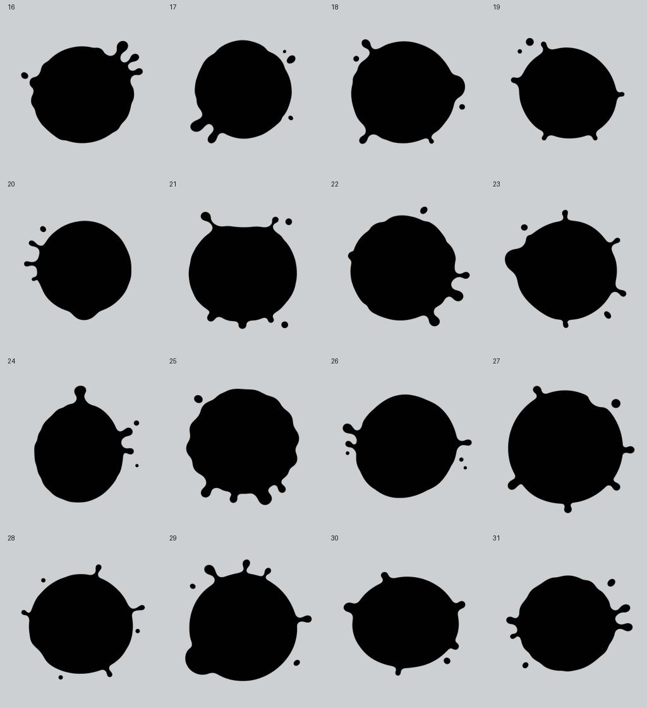

# 32 款落墨图集与随机选型

2026-09-14。新增 16 款已按最新反馈调整为「中间圆润丰满，四周略有溅射状」。第一轮的扇形、长拖尾、深凹口方案未接入项目。新款通过内置 imagegen 分别生成，并逐张检查轮廓和透明背景；后处理仅用于缩放、打包和预览排版。

## 资源

- `Assets/GameResource/Effects/Ink/Textures/Sources/InkSplat-16.png` 至 `31.png`：16 张原始透明 PNG，保留生成结果的 1254×1254 尺寸。
- 同目录 `Shapes/InkSplat-16.png` 至 `31.png`：256×256 独立运行时规格 PNG。
- 同目录 `InkSplatAtlas-32.png`：2048×1024，8 列×4 行，每格 256×256。编号按 Unity UV 原点从左下开始，0–15 原样保留，16–31 为新增款。
- 原 `InkSplatAtlas-Reference.png` 保留，也继续用于原有落点粒子材质。
- [生成提示词、来源文件和 SHA-256](generation-prompts.json)。

在 Unity 菜单「喷墨对战/内容/打包32款落墨图集」重新打包；该工具同时导入、校验并绑定 TrainingGround 和 PrototypeArena 场景。校验入口为「喷墨对战/验证/不规则落墨图集」。源图与运行时 Alpha 不一致时会要求重新打包。

图集要求：可读、Linear、无 Mipmap、无压缩、Clamp、Bilinear、每格边界完全透明、所有格非空。内容签名使用实际 Alpha 字节、布局及采样版本的 SHA-256。当前哈希为 `0c6e1df9565cc60862c24825ad334c58e719de64428b0246945e395981fcee06`，墨水协议为 7，采样版本为 2。

## 运行规则

每名射手有独立的 32 款洗牌袋，每袋内不重复；下一袋前四款避开上一袋最后四款。每次实际沿途落墨或最终撞击推进独立序号。形状随机流不消耗弹道或半径随机数；回合清理时重置。

`ShapeSeed` 的低 5 位编码款式，第 5 位编码镜像，第 6–21 位编码 65536 档旋转。服务器选型，客户端直接解码。跨共面表面分发同一落点时保留同一 seed；快照恢复原始墨量后继续使用服务器的新落点。

CPU 与 GPU 都按命中法线建立投影基，使用相同旋转、镜像、像素中心裁剪及硬度重映射。Shader 用 `SetInteger` 接收索引，并显式计算双线性权重，避免硬件过滤权重量化在低硬度边缘被放大。满 Alpha 的主体保持完整覆盖强度。CPU 网格和相邻表面分发按旋转后的方形投影边界枚举。

## 尺寸

没有修改 Luban 武器数值或原有取样分布，也没有添加视觉尺寸乘数。半径决定投影范围，可见轮廓由 Alpha 和显示阈值共同决定。固定款式、角度及硬度时，包围盒应与半径近似成正比，面积应与半径平方近似成正比。

| 武器 | 撞击半径 m | 沿途半径 m |
|---|---|---|
| 步枪 | 0.65–0.80 | 0.464–0.696 |
| 双枪 | 0.75–0.95 | 0.360–0.540 |
| 霰弹枪 | 0.50–0.85 | 0.144–0.216 |
| 手枪 | 0.60–0.75 | 0.224–0.336 |
| 火箭筒 | 1.20–1.50 | 0.464–0.696 |

共享图集从 RGBA32 4 MiB 增至 8 MiB，另有一份 CPU Alpha 缓存从 1 MiB 增至 2 MiB；可读 Texture2D 的 CPU 副本也随尺寸增长。每个表面的 RenderTexture 数量和规格保持原结构。

## 验证入口

- EditMode：`InkShapeAtlasTests`、`InkCoverageTests`、`GameplayUpdateTests`、`ShooterMovementTests`、`HeroMigrationTests`、`InkSimulationTests`、`TrainingGroundTests`。
- GPU/Editor：`Splatoon.Editor.InkShapeValidation.Run`，需真实图形设备。输出逐格一致性、尺寸 CSV、三层显示检查、快照继续喷墨、长墙接缝与反面隔离结果。尺寸截图从左至右为最小／中间／最大半径。
- Play Mode：`InkImpactHostPlayTests.RealMapProjectileRpcPaintAndCosmeticIsolation`，真实 Boot/TrainingGround 主机和五种武器，检查持久 Mask、DisplayMask、材质绑定及快照恢复。
- 本机运行日志在 `Reports/InkShapes32/`。本次已完成本机多进程晚加入／重连验证；实体双机、目标设备视觉与 720p 四人性能仍需单独验收。详见 [本次验证记录](validation.md)。
