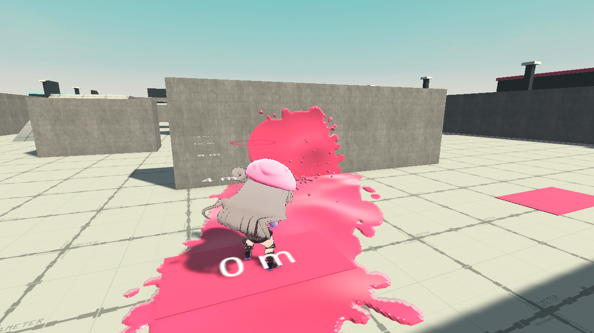
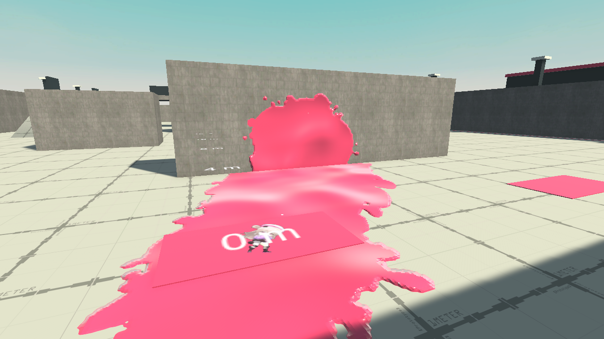

# 铃芽与广域标记枪验收

本文保留 2026-09-18 旧 Q 版模型的历史证据。2026-09-20 正式模型已替换为 SummerCuteness；当前体型、模型和验收结论以 [SummerMigration.md](SummerMigration.md) 为准。

验证日期：2026-09-18。Unity 6000.3.9f1，Windows。包为项目正式构建入口生成的 Windows x64 / Mono / Development 版本。

使用独立副本 `D:/XPHUNITY/ProjectSplatoon-RifleGirlChibi-Validation-20260917` 导入、测试和构建，主项目 Editor 保持打开。结果资源、代码和完整 Windows 包已同步回 `D:/XPHUNITY/ProjectSplatoon`。

## 已完成的检查

| 检查 | 结果与边界 |
|---|---|
| 源表与静态资源 | 874 项通过；TbHero 源表 → 正式 Luban → HeroConfig / tbhero.json 一致 |
| 旧数据保护 | 原表全部既有单元格值与样式保留；原七名英雄的既有 JSON 字段不变；196 个既有武器文件逐字节不变 |
| Addressables | 新增 5 个 Sploosh 地址，原有 64 个地址内容不变 |
| Unity 测试 | 208 个不同测试全部通过；一次 205 项回归和最后一次 39 项针对性验收，重叠用例去重统计 |
| Avatar / 动作 | 有效 Humanoid Avatar；10 动作 × 3 个俯仰角 × 13 个时间采样，共 390 个姿态；骨骼坐标有限 |
| 左手握把 | 非死亡动作支持手位置最大偏差约 2.73×10⁻⁷ m，低于 1 cm 门槛；这是采样点位置误差，不是手指造型评价 |
| 正式角色与纸片 | 静止与四向移动的头、手、脚骨骼位置匹配；同时间动画重放命中剪影一致；不同时间会变化 |
| 小体型 | 主机 / 恢复胶囊、禁用控制器时的远端胶囊、潜墨胶囊均使用新尺寸；低台阶可越过，高障碍被阻挡 |
| 纸片运动 | 小体型空中可见落地与物理落地一致；上墙、墙跳、翻越、空中换角回放通过 |
| 低顶切换 | 真实 Host 在空间不足时拒绝 8→1 并返回原因；空间足够允许；同体型旧英雄在低顶潜墨时仍允许切换 |
| 武器数值 | 起手 / 出墨起手、5 帧间隔、125 发耗墨、38→19 弹龄衰减、15 帧回墨锁定、独立射后限制通过 |
| 散布和移动 | 连射偏置、跳跃散布、前向移动速度继承通过；五发循环及中断重置通过 |
| 墙墨 / 遮挡 | 高悬墙面产生撞墙墨和阶段流墨；离墙墨滴落地；不可涂遮挡阻止实际下落路径 |
| 真实受击 | Play Mode Host 通过生产弹丸与 PhysX 验证远端小胶囊 38 / 38 / 38 三发击倒、死亡 / 重生保留英雄，以及纸片剪影受击 |
| 枪口与相机 | 小枪口嵌墙被阻挡、墙面阻断伤害、相机遇遮挡收近通过 |
| 热更新 | 真实 Host 调参后新配置生效，飞行中的弹丸保留旧详细参数；循环结构变化需要重启攻击状态 |
| 原七名英雄回归 | 7 英雄 × 9 场景，对比任务前冻结记录，63 个涂墨归属哈希、墨迹数和弹丸数一致 |
| 帧率一致性 | 新武器 9 场景 × 3 固定种子 × 30 / 60 / 144Hz，共 81 次测量；归属哈希、墨迹数、耗墨一致 |
| Windows 构建 | 正式 Addressables + Boot 构建成功；343 个文件，284,823,431 字节，逐文件 SHA-256 复制校验通过 |

原有两条测试中的协议号 24、快照长度 525 已更新为任务开始前就在使用的协议 31、533 字节，并保留全字段序列化往返检查。此次没有修改这些网络结构。原版算法对照未参与这些通过结论。

## 固定种子涂墨测量

每组为 10 发完整开火过程，种子 0 / 1 / 2，以下为 60Hz 三个种子的平均值。面积包含所有实际涂中表面；连通距离为地面从起始区域连通的前向距离。近 / 中 / 远墙距离是本项目测试夹具的 1 / 6 / 12 m，不是原版地图测量点。墨迹面积不是伤害射程。

| 场景 | 总涂墨面积 m² | 地面连通距离 m | 三种子的墨迹事件数 |
|---|---:|---:|---|
| 平地 | 24.073 | 9.792 | 22 / 22 / 21 |
| 上瞄 30° | 30.453 | 11.792 | 26 / 26 / 26 |
| 下瞄 30° | 15.849 | 5.125 | 13 / 12 / 12 |
| 高台落差 | 27.224 | 6.042 | 26 / 26 / 26 |
| 近墙 | 6.177 | 1.375 | 80 / 82 / 78 |
| 中墙 | 18.677 | 7.750 | 70 / 87 / 62 |
| 远墙 | 24.792 | 10.000 | 22 / 22 / 22 |
| 斜面 | 30.609 | 9.833 | 22 / 22 / 22 |
| 不可涂遮挡 | 6.552 | 3.167 | 6 / 6 / 6 |

墨迹的最终显示轮廓与归属均消费同一权威事件；面积统计不等于对每个显示像素与归属格逐像素证明。

## 联机验证

**最终通过。** 结果记录于 `Reports/SplooshGirl/Network-Combat/comparison.json`，详细证据在同目录的 `host.txt`、`client.txt`、日志与截图。[可随文档保留的结果副本](Network.json)。两进程使用同一个已校验的 Windows 包，均以退出码 0 正常退出。

| 项目 | Host | Client |
|---|---:|---:|
| 铃芽有效发射数 | 297 | 182 |
| 看见两个独立玩家 | 通过 | 通过 |
| 远端小体型 / 纸片形态 | 通过 | 通过 |
| 8→1→8 选角切换 | 通过 | 通过 |
| 互射阶段掉血及命中确认 | 通过 | 通过 |
| 死亡重生保留英雄 / 回合重置 | 通过 | 通过 |
| 迟加入与显式补同步 | 权威端 | 8 秒后加入、收到 2 次快照 |
| 最终涂墨归属哈希 | 3373027149 | 3373027149 |
| 最终涂墨事件序号 | 1873 | 1873 |
| 运行错误 | 0 | 0 |

双方内容签名相同：`d338f256e78190fb7b9b8d0773b8fc33a53d94bdc1e81fb7be2e96076d1035cb`。

互射夹具将两个玩家放在相距 2 m 的已知开阔位置；双方通过各自正常输入、预测、命令传输与主机弹丸流程开火，分别收到命中回执。随后额外触发死亡以覆盖双方重生，最后等待所有墨迹结算再比较归属。它验证联机流程，不测量真实 LAN 时延。

第一轮工具验证记录保留在 `Network`：默认截图接口错误读取涂墨 RenderTarget，并且移动到掩体后的增长换角不满足夹具的成功前提。已改为独立相机 RenderTarget、等待真实纸片画面，以及在已知开阔出生位验证成功切换。`Network-Final` 是上述修正后的通过记录，`Network-Combat` 进一步加入真实互射确认，是最终交付判定。

## 证据与复跑

- `Reports/SplooshGirl/acceptance-final.xml`、`final-geometry.xml`、`test-summary.json`：逐用例结果。
- `Reports/SplooshGirl/static.json`：源表、Luban、原资源保护和协议结构静态检查。
- `Reports/SplooshGirl/animation.txt`、`playmode.txt`：动画误差和真实 Host 场景验收。
- `Reports/SplooshGirl/Measurements/seed-{0,1,2}`：逐帧弹道、权威墨迹 CSV、覆盖图、面积 / 连通距离 / 哈希 JSON。
- `Reports/SplooshGirl/build-final.log`、`package-sha256.json`：正式构建与完整包复制核对。
- `Reports/SplooshGirl/built-inputs.json`：657 个脚本 / 相关资源输入与独立构建副本一致，最终完成时再次核对未变化。
- `Tools/ValidationData/SplooshGirl/LegacyPaintBaseline.json`：旧七英雄冻结回归样本。
- `Reports/SplooshGirl/Baseline`：执行前 889 个文件快照、工作区差异与 SHA-256，保持冻结。
- 静态复跑：`python Tools/CombatGirls/validate_sploosh.py`（需要 openpyxl）。
- 双进程复跑：`Tools/CombatGirls/run_sploosh_acceptance.ps1 -OutputDirectory Reports/SplooshGirl/Network-第二次`。该脚本不会覆盖已有验收记录。

## 明确未完成的验收

物理双机 LAN、真实网络延迟 / 丢包、目标移动设备性能与 GPU 开销、原版实机误差对照均未验证。Windows 两进程验证不能替代上述测试。截图来自 Unity / Windows 实际运行；本次没有制作新的正式武器美术，仍使用批准的 0.55 倍步枪占位模型。
