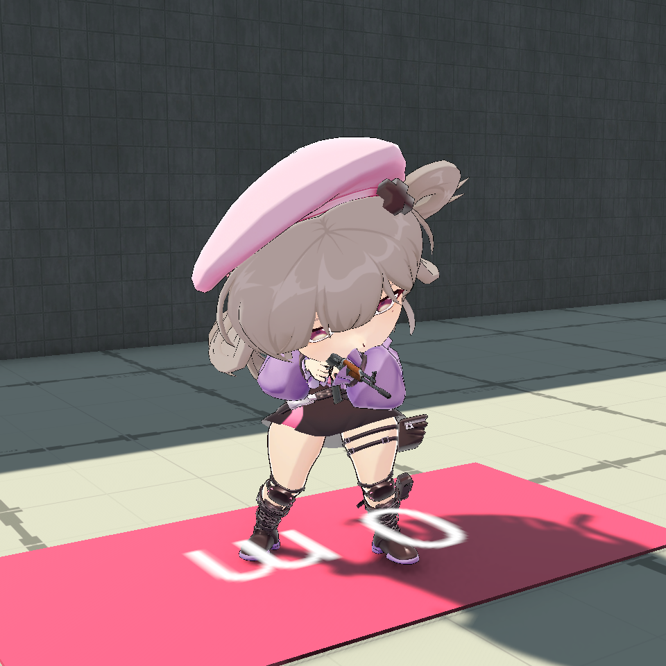

# 铃芽 / SplooshGirl

英雄 ID **8**，主武器 **广域标记枪**。进入热身选角或单机武器调试，选择「铃芽」。正式资源通过 Addressables 加载。

沿用 RifleGirlChibi 的 2.5 头身模型、蒙皮、Humanoid Avatar 和原 RifleGirl 的 10 个动作。武器为独立的原步枪 0.55 倍占位模型。本次没有副武器或特殊武器。

## 资源与制作入口

| 内容 | 项目路径 |
|---|---|
| 正式角色 | `Assets/GameResource/Characters/SplooshGirl/Prefabs/SplooshGirlVisual.prefab` |
| 表现与逻辑枪口 | `Assets/GameResource/Characters/SplooshGirl/SplooshGirlPresentation.asset` |
| 独立武器 | `Assets/GameResource/Weapons/SplooshGirl/Prefabs/SplooshGun.prefab` |
| 武器参数 | `Assets/GameResource/Weapons/SplooshGirl/SplooshGirlWeaponConfig.asset` |
| 独立弹药参数 | `Assets/GameResource/Weapons/SplooshGirl/SplooshGirlAmmoConfig.asset` |
| 动态纸片与剪影 | `Assets/GameResource/Characters/Shared/Paper/SplooshGirl/` |
| 头像 | `Assets/GameResource/UI/HeroPortraits/SplooshGirlPortrait.png` |
| 英雄源表 | `Config/Luban/source/TbHero.xlsx` |

Unity 菜单「喷墨对战 / 角色 / 安装铃芽与广域标记枪」只生成本英雄资源，注册角色、武器、武器配置、弹药配置、头像 5 个地址。保留既有 64 个地址。该入口会重设本英雄的制作参数；手工调参后不要无意重跑。

批处理入口为 `Splatoon.Editor.SplooshGirlBuilder.InstallBatch`。构建入口 `Splatoon.Editor.SplooshGirlBuilder.BuildBatch` 调用正式 `PrototypeBuilder.BuildWindowsTo`，先构建 Addressables，再构建 Boot 场景，输出整个 `Builds/SplooshGirl` 文件夹。

## 体型与动画

站立高 1.20 m、半径 0.25 m、潜墨高 0.50 m、台阶偏移 0.20 m、碰撞皮肤 0.02 m；胶囊中心是对应高度的一半。帽子和外伸头发不扩大站立胶囊。原有七名英雄维持 1.8 / .35 / .7 / .3 / .03 m。

`HeroBodyShape` 由快照 HeroId 推导，主机模拟、本地预测、回滚恢复和远端受击代理共用尺寸。主机在体型变大前检查站立空间；不足时保留原英雄并提示「空间不足，无法切换到该英雄」。同体型或缩小体型保留原切换流程。空中换体型保留隐含人形脚底位置，重算纸片原点与相机过渡偏移。

纸片显示尺寸 .6 × 1.2 m，命中网格来自实际动画剪影。纸片和正式人物使用同一套骨骼、动作、武器挂点及已烘焙的左手手腕补偿。空中纸片的可见接触面、物理落地点一致。

AimIdle 持枪采样的局部逻辑枪口为 `(0.117177635, 0.6385543, 0.40609595)` m；枪口绕测量得到的胸部瞄准枢轴变化。实际选角射程通过 `HeroFlatRange` 使用本英雄枪口与相机配置计算；准星落点通过 `WeaponImpactPrediction` 共用权威弹道，并包含前后移动的前向速度分量。

## 玩法

- 单枪口、单弹、全自动，5 个参考帧一发，12 发/秒。
- 38 → 19 伤害，弹龄 6～22 帧衰减。100 血近距离三发击倒。
- 每发 0.8 墨，满 100 墨发射 125 发；末发后 15 帧锁定回墨。
- 地面 / 空中散布 11.66° / 17.49°，逐发偏置及跳跃恢复。
- 射击移动速度约 3.594 m/s。
- 三段落点宽度、入射角 / 落差纵深、五发墨滴循环、小数预算累计、脚下墨、分阶段墙墨、离墙下落与真实轨迹遮挡。

详细规则由 `shooterDetails` 独立开关控制，只有铃芽启用。新参数具有中文 Inspector、合法性校验、不可变运行快照、热更新比较及内容签名。改变循环结构、射后限制或开关会重新启动当前攻击配置；飞行中的弹丸和墨滴保留生成时的配置。

玩法模拟版本由 12 升至 13。PlayerSnapshot（协议 31、序列化 533 字节）和 PaintStamp 的既有结构没有增加字段；五发循环复用连射序号。

参数证据和未证实算法见 [Reference.md](Reference.md)，验证结果与环境边界见 [Acceptance.md](Acceptance.md)。项目验证不能证明与原版实机完全一致。
