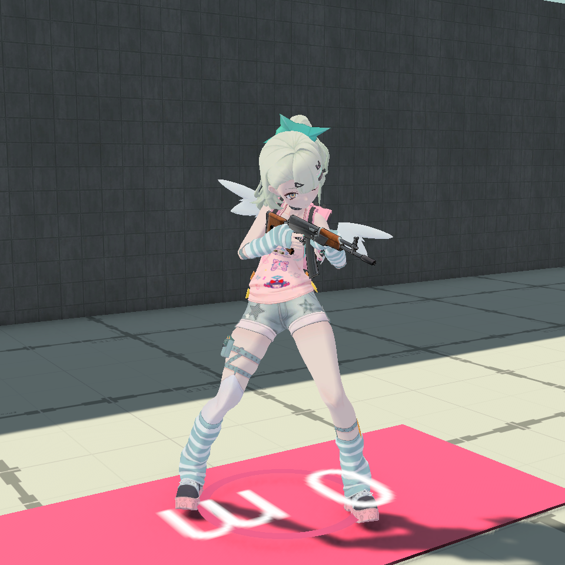
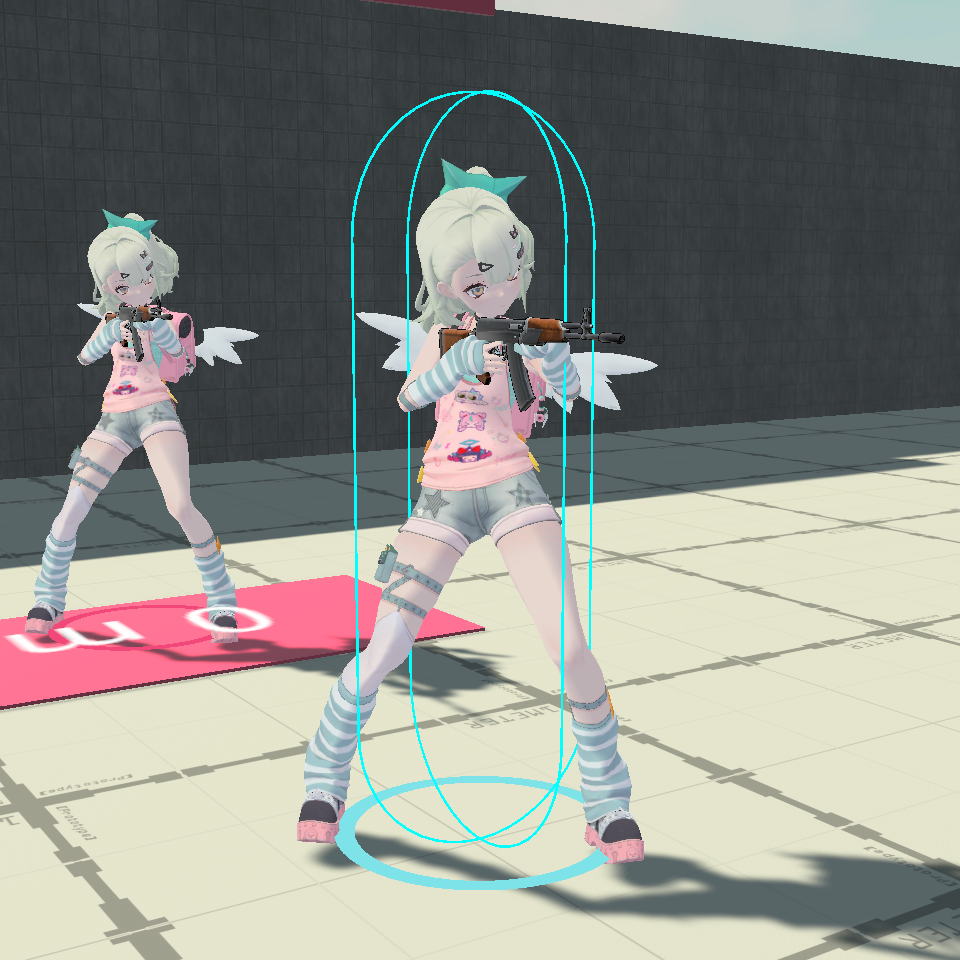
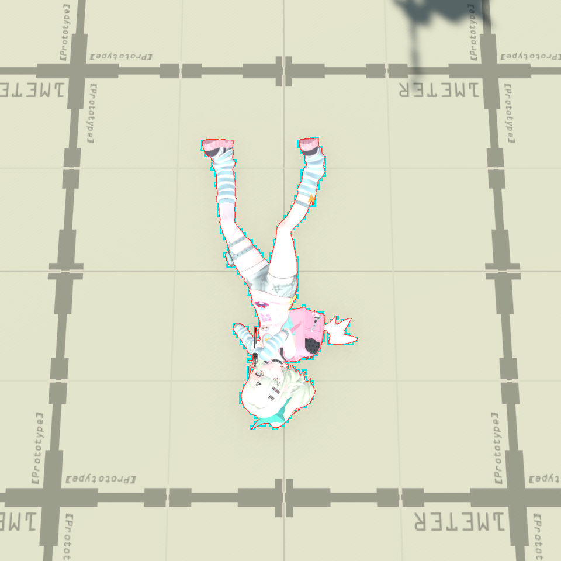

# 铃芽 SummerCuteness 模型移植

2026-09-20，Unity 6000.3.9f1 / URP。Hero 8「铃芽」的正式模型已经替换为 SummerCuteness，保留原比例与 1.500024 米身高，继续使用广域标记枪。角色与武器地址、头像、伤害和其他玩法参数保持不变。



## 模型与重建

- `ArtSource/Characters/SplooshGirlSummer/Source` 保存 33 个原始文件；SHA-256 与下载原件逐项一致。
- `Scripts/build_model.py` 在 Blender 中将原 A 姿势变换为 T 姿势，变换网格、全部形态键和法线，再重建骨骼绑定矩阵。保留 320 根骨骼、30,639 个三角面，无未绑定顶点。修改源文件为同目录 `SummerCuteness.blend`。
- 正式资源在 `Assets/GameResource/Characters/SplooshGirl`。独立 Humanoid Avatar 映射躯干、四肢、手指和脚趾，独立控制器与上身遮罩复用现有 10 个动作。关闭根运动。
- 四方向播放速度按新骨架实际脚步跨度测量，已写入控制器 BlendTree。双手挂点、支撑手 IK、枪口、胸部瞄准枢轴和相机均重新校准。旧 Q 版骨架与手腕补偿不再参与构建。
- 9 个材质用原贴图和项目 Toon Shader 重建。下载素材没有原 Shader；原头发阴影覆盖片、害羞覆盖片依赖该特殊 Shader，在中性外观中关闭。本轮没有增加布料物理或表情系统。

重建命令与 Unity 菜单见 [源文件说明](../../ArtSource/Characters/SplooshGirlSummer/README.md)。在 Unity 中使用「喷墨对战 / 角色 / 重建铃芽 SummerCuteness 模型」。仅重新生成美术时使用此入口；原「安装铃芽与广域标记枪」还会初始化武器参数。

## 体型、纸片与受击

仅修改 `TbHero.xlsx` 中 Hero 8 的五个体型值，然后运行 Luban。生成 JSON 与运行时 `HeroBodyShape` 共用这一来源。

| 配置 | 修改前 | 修改后 |
|---|---:|---:|
| 站立高度 | 1.2 m | 1.5 m |
| 半径 | .25 m | .28 m |
| 紧凑高度 | .5 m | .625 m |
| 台阶偏移 | .2 m | .25 m |
| 碰撞皮肤 | .02 m | .025 m |

站立中心为脚底上方 .75 m，紧凑中心 .3125 m。队伍光环保持脚底上方 .025 m。原整体胶囊命中机制继续使用，没有分部位伤害；外伸头发、背包和四肢不单独增加站立命中部位。

纸片显示尺寸更新为 .75 × 1.5 m，捕获模型与正常角色共用新 Avatar、控制器和握枪修正。动态命中网格继续来自逐帧模型剪影。纸片内容哈希为 `04f9831d4f8859823e381e4a12ea0dc16f0af7f4ef3778ee1f1a1eb997e2f3a2`。





## 验证结果

所有导入、测试和构建使用独立副本 `D:/XPHUNITY/ProjectSplatoon-SummerValidation-20260920`，没有关闭主项目 Editor。相关资源同步回主项目，并核对 349 个运行时代码、模型、纸片、武器和配置输入一致；文本比较仅忽略行尾格式与尾随空白，二进制逐字节核对。

| 验证 | 结果 |
|---|---|
| 静态检查 | 913 项通过，196 个既有武器文件逐字节保持不变 |
| 10 个动作采样 | 750 个姿势，支撑手最大误差 0.0000002703 m |
| 实际 Host Play Mode 过渡检查 | 17 阶段、1,020 帧，支撑手最大误差 0.000002269 m，枪口角度误差不超过 .0792° |
| Unity 相关回归 | 114 项中 107 通过、7 项既有失败，详见下文 |
| 追加 Play Mode 渲染与状态恢复检查 | 1/1 通过，包含站立/潜墨命中、死亡、复活和过渡截图 |
| Windows Development 构建 | 成功，完整包 343 个文件复制后 SHA-256 一致 |
| 同机独立 Host + Client | 通过，双方运行错误为 0 |

动作检查覆盖待机、四方向移动射击、左右转身、空中、上瞄 65°、下瞄 75°、前后死亡、潜墨中死亡和三种复活恢复。逐帧检查支撑手、枪口方向和状态恢复，渲染检查肩肘、腕部、髋膝及衣物。手动在同一 Play Mode 帧内采样的截图先固定已计算的蒙皮网格，防止截图请求复用旧姿势缓存；正常游戏相机截图由独立 Windows Player 连续运行取得。

受击验证覆盖新身高的上身、躯干、腿部三发扣血，胶囊外射击未命中，潜墨剪影致死，死亡关闭命中代理，复活恢复 1.5 m 体型，低顶空间限制、台阶、空中形态切换、脚底连续性、墙体遮挡、逻辑枪口阻挡和相机碰撞。

7 项失败均为 `SplooshGirlTests.ExistingHeroesKeepFrozenPaintOwnership(1..7)` 的历史涂墨哈希基线。将隔离副本中的测试代码和英雄 JSON 恢复到本次修改前的 Git HEAD 后，这 7 项仍得到完全相同的失败信息。本次没有改写其他英雄的历史涂墨基线，因此不能将整套回归标为全绿。逐项对照保存于 `Reports/SplooshGirlSummer/baseline-failure-comparison.json`。

## 独立进程联机与交付

| 项目 | Host | Client |
|---|---:|---:|
| Hero 8 发射数 | 274 | 234 |
| 真实射击掉血 / 命中回执 | 通过 | 通过 |
| 远端体型 / 潜墨 / 8→1→8 | 通过 | 通过 |
| 死亡复活 / 回合重置 | 通过 | 通过 |
| 最终涂墨归属哈希 | 2777567930 | 2777567930 |
| 最终涂墨事件序号 | 3462 | 3462 |
| 显式补同步 | 权威端 | 收到 2 次快照 |
| 运行错误 | 0 | 0 |

双方内容签名一致：`52854b86672faae84d97cb6b260139305b3195c517bfc3419e0ee8ebd3745707`。[联机结果](Summer/Network.json)。这是同一台 Windows 电脑的两个独立进程，尚未验证物理双机 LAN、真实网络损耗和目标设备性能。

交付包位于 `Builds/SplooshGirlSummer/InkLan.exe`，运行或搬移时需要保留整个目录。复跑双进程：

```powershell
& Tools/CombatGirls/run_sploosh_acceptance.ps1 -PlayerPath Builds/SplooshGirlSummer/InkLan.exe -Port 18528 -OutputDirectory Reports/SplooshGirlSummer/Network-NewRun
```

持久证据在 `Docs/SplooshGirl/Summer`，完整本地日志、逐动作截图和 SHA-256 清单在 `Reports/SplooshGirlSummer`。主要结果文件为 `verification.json`、`final-tests.xml`、`unchanged-baseline-tests.xml`、`rendered-transitions-tests.xml`、`windows-build-final.log` 和 `Network/comparison.json`。
