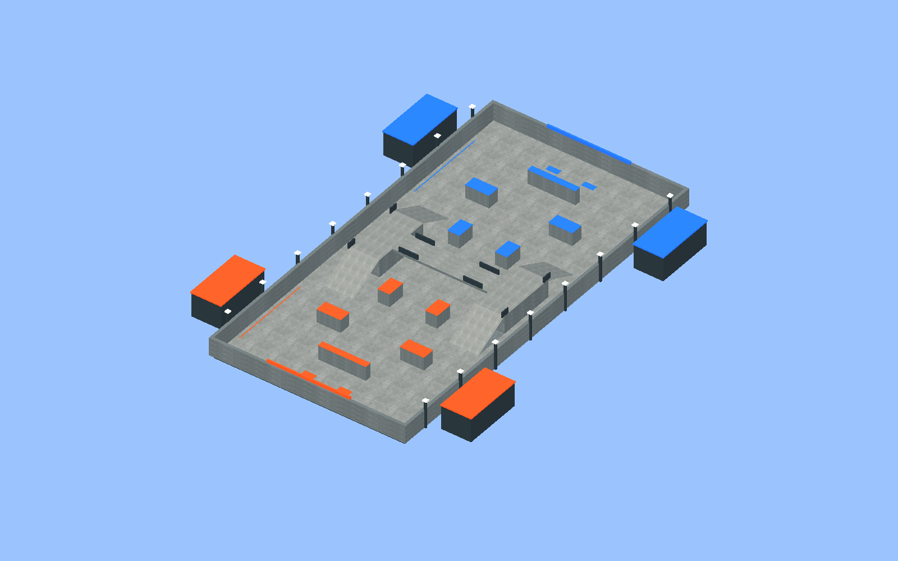
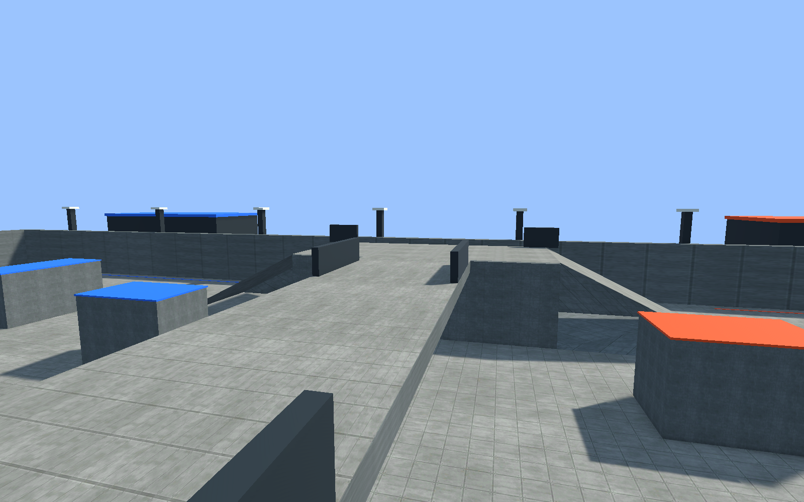
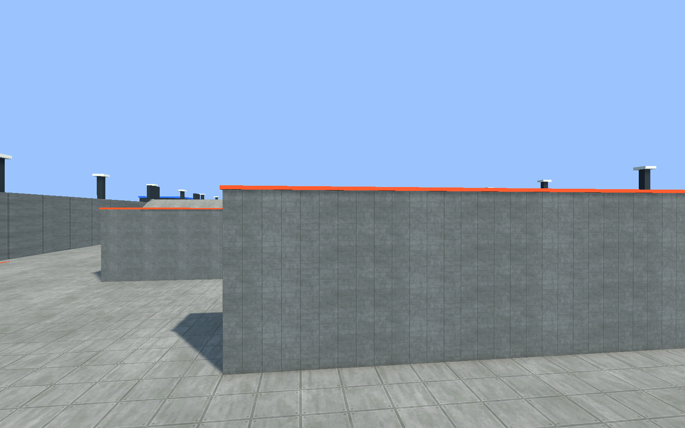

# 固定立体训练场

默认场景：`Assets/GameResource/Gameplay/maps/TrainingGround.unity`。地址：`maps/TrainingGround`。地图是已保存的 Unity Scene，启动、加载和构建过程不生成地图几何。

## 编辑与运行

1. 通过 **喷墨对战 / 地图 / 打开立体训练场** 打开并编辑地图。
2. 修改几何、碰撞体、出生点或可行走表面后执行 **校验并烘焙当前地图**。表面 ID 必须稳定且唯一；可行走面使用单位缩放，尺寸在局部 X/Z 平面中以米计量。
3. 编辑场地配置时修改 Luban 源表，再运行 `cmd /c Config\Luban\gen_luban.bat`。
4. 从 `Assets/Scenes/Main/Boot.unity` 运行游戏，创建或加入房间即加载新地图。编辑地图 Scene 不要求进入运行模式。
5. **喷墨对战 / 构建 / Windows 正式资源版本** 构建 Addressables 与 Windows Player。已有地图不会被首次创建工具或旧资源安装器覆盖。

构建设置仍只有 Boot。进入房间时以 Additive 方式加载并设置战斗 Scene 为活动场景；退出时恢复 Boot、关闭会话并卸载地图。

## 布局与规则

| 项目 | 当前值 |
| --- | --- |
| 可玩边界 | X = -16～16 米，Z = -32～32 米 |
| 出生点 | 粉队南端、蓝队北端，各两个 |
| 高台与桥面 | 高 3 米，中央桥宽 4 米 |
| 坡道 | 四条，宽 5 米，水平长 6 米，坡度约 26.565° |
| 桥下净高 | 2.58 米 |
| 外侧绕行净宽 | 3 米 |
| 涂色表面 | 36 个，其中 15 个可行走计分表面 |
| 归属精度 | 各表面局部网格 0.125 米 |
| 有效计分面积 | 约 2052.331 平方米，包含高台、桥面和坡道，排除烘焙的不可达区域 |
| 涂色纹理 | 约 32 像素/米，矩形 RT 与长墙分图集；常驻 91.49 MiB，含最坏检查点峰值 118.68 MiB |

地面分块保持每米 32 个绘制像素，与原地面密度一致。同一平面的相邻地块连续喷涂；桥面与桥下不共享归属。坡道按斜面实际面积统计，末端不足一个网格的部分按实际面积加权。障碍投影在 0.125 米采样精度下排除。墙壁、桥底和掩体侧面可喷涂但不计分；角色查询脚下实际碰撞表面来决定潜墨、回墨和敌墨减速。

可行走面顶面与实体侧壁分别绑定。旧的单一 `Size` 配置已改为 `Width=32`、`Length=64`；场地几何布局版本为 3，粉蓝墨水检查点格式及连接协议为 4。连接签名包含配置和已烘焙地图拓扑，旧构建会被拒绝。

## 地图版本 3 的历史验证记录（2026-09-11）

以下为地图落地时的验证；墨水修复版本 4 的最新验证见 [墨水修复报告](InkLook/Implementation.md)。

验证使用 Unity 6000.3.9f1，在独立副本中执行。交付 Scene、运行时代码和测试所用副本已核对一致；没有启动或关闭用户当前编辑器中的场景。

| 验证 | 结果与证据 |
| --- | --- |
| Luban | 源表 → 生成 C#/JSON 成功，矩形尺寸与版本一致 |
| Unity EditMode | **45 / 45 通过**；含矩形边界、斜面面积、不可达格、覆盖/清空、检查点、跨层隔离、地块接缝、高台跳落和外侧路线 |
| GPU | **36 / 36 表面通过**绘制、清空和纹理恢复；释放后 RT 计数为 0 |
| 实际角色模拟 | 图形版 Player 验证底层、桥面和坡道上的潜墨、回墨及敌墨减速 |
| 实际 CharacterController | 四坡道、高台、横桥和桥下通路通过；桥下相机避障通过 |
| Windows 构建 | Addressables 与 Windows Player 构建成功，输出 `Builds/Windows/InkLan.exe` |
| 同机双进程 | 完整 180 秒对局、结算和第二局启动通过；双方面积一致 |
| 多层同步 | 15 个可行走表面的 GPU 纹理哈希全部一致；归属哈希均为 `2952120506` |
| 中途加入 / 退出重进 | 初始检查点恢复成功；客户端两轮退出/重进成功 |
| 加载与卸载 | 房主三次创建/卸载成功；加载中取消得到预期提示；房主退出后客户端返回菜单 |
| 版本不一致 | 使用旧地图拓扑的客户端被明确拒绝 |

同机自动化测试不代替两台实体电脑的局域网验证；人工键鼠手感、长期对战平衡与两台实体电脑验收仍待进行。

可复查的本地证据位于 `Logs/TrainingGround/`：`complete-tests.xml`、`gpu.log`、`acceptance-build.log`、`accepted-host.log`、`accepted-client.log`、`round-host.log`、`round-client.log`、`cycles.log`、`cancel.log`、`mismatch.log`。自动化涂地/通行诊断仅在开发构建显式传入 `-inkSmokeCase map` 和 `-lanSmokeHost/-lanSmokeClient` 时启用。

## 场景截图

