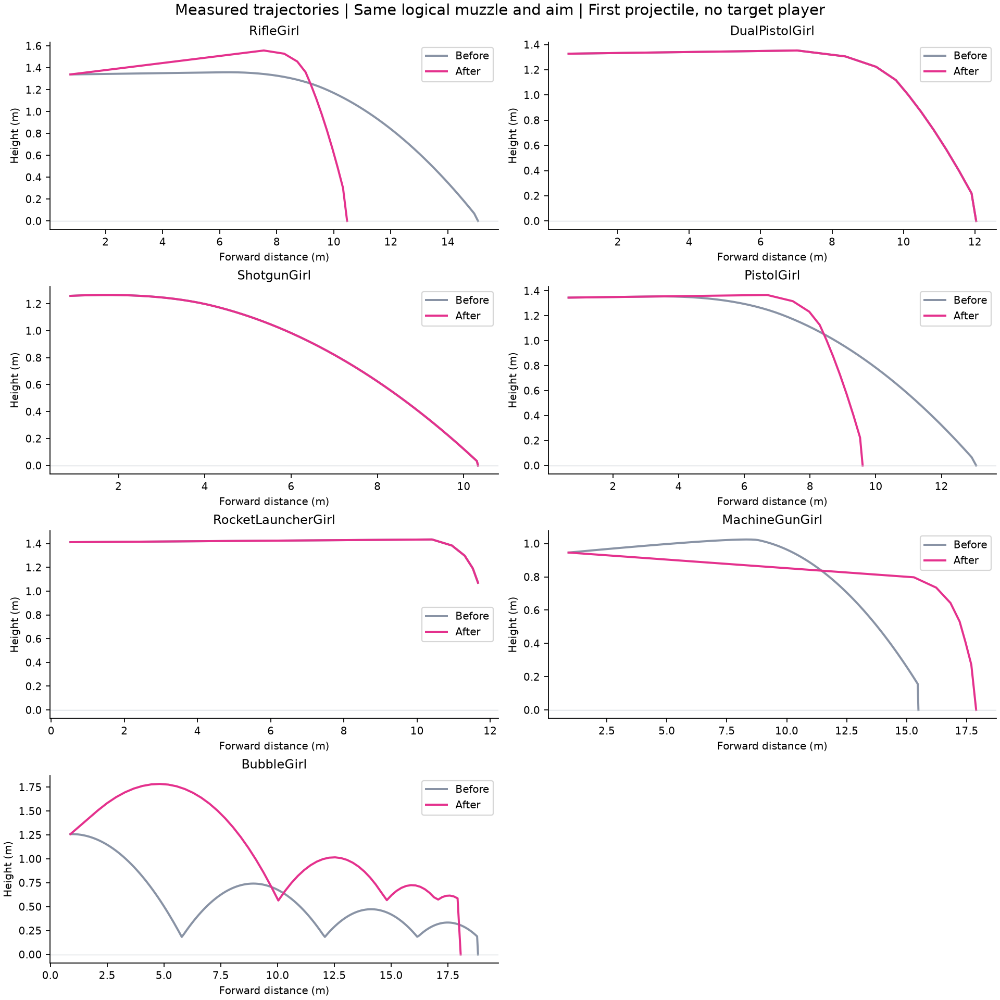
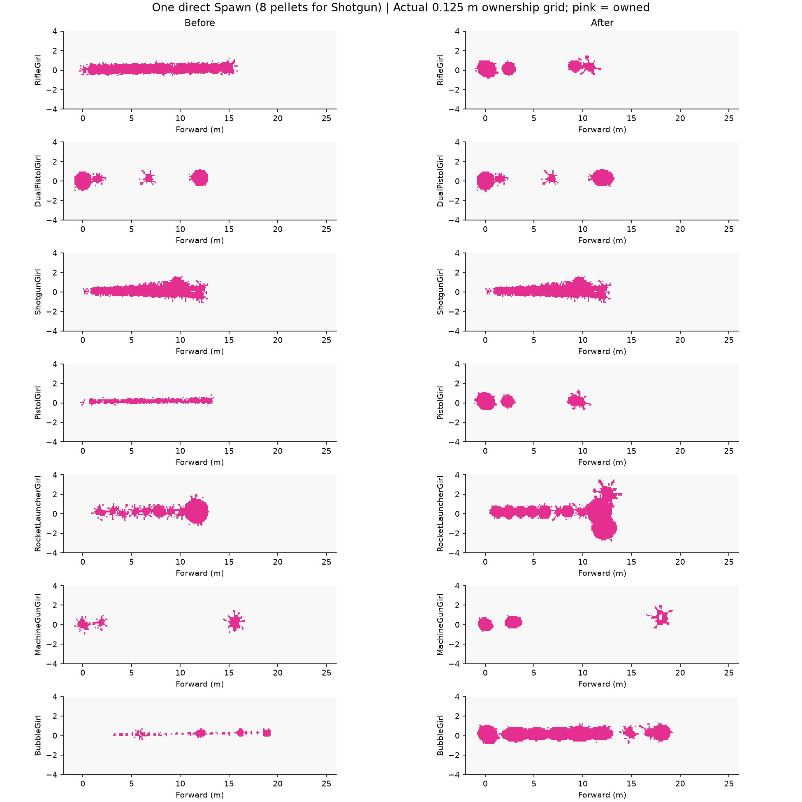
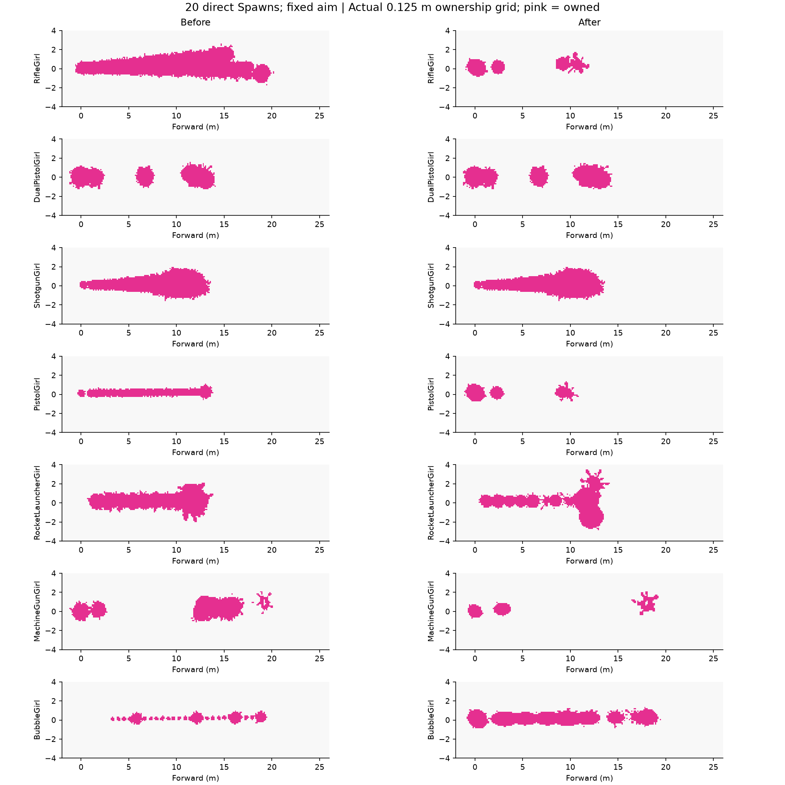
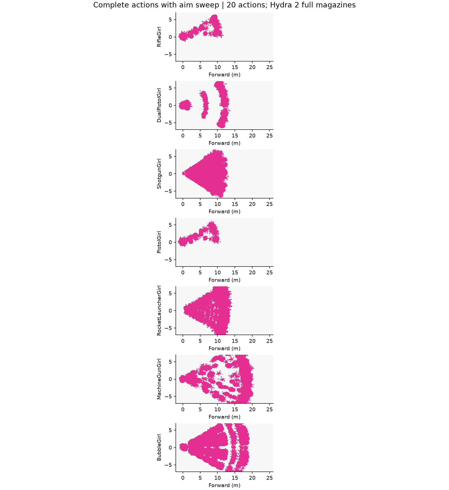

# 喷3 11.3.0 武器对齐：实现与验收记录

基准：无技能、100生命、100墨量；S=18/24.037。RifleGirl 对标斯普拉射击枪，双枪仅普通射击，霰弹枪保留冻结资产。所有时间字段以秒保存。角色、美术图集、副武器、特殊武器、装备技能不在本轮重做范围。

## 最终配置

| 角色／对标 | 射击节奏 | 伤害 | 耗墨 | 行走／友方墨中游泳 |
|---|---|---|---|---|
| RifleGirl／斯普拉射击枪 | 10 次/秒 | 36→18 | 0.92 | 4.31335／8.62670 m/s |
| DualPistolGirl／开尔文525（普通射击） | 6.667 次/秒 | 36→18 | 1.4 | 4.31335／8.62670 m/s |
| ShotgunGirl／自定义八弹丸霰弹枪 | 2.5 次/秒 | 16→8 | 4 | 4.31335／8.62670 m/s |
| PistolGirl／窄域标记枪 | 12 次/秒 | 28→14 | 0.8 | 4.67280／9.05804 m/s |
| RocketLauncherGirl／普通快速爆破枪 | 1.714 次/秒 | 85→85 | 7 | 4.31335／8.62670 m/s |
| MachineGunGirl／消防栓旋转枪 | 15 次/秒 | 未满蓄32／满蓄40→16 | 满蓄35／66发 | 3.95390／7.76403 m/s |
| BubbleGirl／满溢泡泡枪 | 32 帧/组，5 帧/颗 | 32→32 | 8 | 4.31335／8.62670 m/s |

步枪由15降至10发/秒、耗墨0.85→0.92；手枪伤害衰减起点10→4参考帧；消防栓第一圈1.5→2秒；泡泡30→32伤害、33→32帧组周期、3→5帧颗间隔。消防栓第一圈33发、满蓄66发；爆破碰撞涂墨半径0.97563→1.72234米。整箱墨实发108次步枪、125次手枪、71次双枪、14次爆破、12组泡泡；霰弹枪25次齐射。

[全部字段前后表](AllFields.csv) 包含保留值；[导入依据](Tuning.json) 区分 source-explicit、reference-simulator-default、project-adaptation，保留原始数字、转换值、字段路径和固定提交链接。retained-project-value 表示保留项目值，不能视为已证实原作值。代码默认字段也纳入不可变快照和内容签名。

## 实现

- 五种射击武器统一直进、4参考帧制动、自由飞行；60Hz离散参考积分，帧间线性取样。权威、展示、准星入口共用 `InkBallistics/ReferenceBallistics`。泡泡使用单独的阻力、重力与逐颗初速，并同步颗序和反弹段。
- 连续扫掠区分场景／玩家半径；移除参考武器以展示射程硬截断伤害的路径。界面分别显示直进、伤害衰减区间、标准1.4米枪口的平地落点和几何涂墨上界；上界不是实际占有面积。
- 步枪、消防栓和爆破枪使用逐发偏置、停火恢复、跳跃年龄恢复；消防栓水平／垂直采样分开，蓄力不增散布。双枪保留普通射击规则，手枪保持零散布。
- 命中、沿途、脚下、爆炸、弹跳分别生成。沿途墨滴实际下落碰撞，不生成伤害或独立网络对象。方向和纵深统一作用于CPU归属与GPU图集；爆炸多落点按8方向局部遮挡裁剪，墙面使用分段下落覆盖。
- 发射冻结武器快照，调试房新弹丸采用新值，普通联机房配置固定。玩家协议30、武器模拟10、涂墨协议9，内容不匹配拒绝加入。PaintStamp由53增至102字节（序列化负载，不含传输开销）；重同步按实际序列化长度分块，不能宣称带宽减少。
- 服务按60Hz稳定排序推进，并补算迟到的新弹丸；涂墨待处理数量与战斗弹丸数量分开。随机种子不依赖全局弹丸ID；霰弹图集袋保留每位射手的历史顺序。

## 项目实测

真实 Unity Physics、逻辑枪口、0.125米归属网格；水平平地、固定种子。原始修改前数据在任何修改前冻结；旧覆盖图由冻结参数重放，并逐项校验与冻结哈希一致。直接发射用于前后可比；完整动作包含泡泡四颗和消防栓整弹仓。墙面／高台、上下30°、遮挡、连续、整箱墨、往返横移和摆动瞄准数据见 [测量表](Measurements.csv)。横移为±5米正弦路径，不代表恒定速度扫射的原作样本。

| 武器 | 单次直接发射面积：修改前→后 | 20次直接发射面积：修改前→后 |
|---|---:|---:|
| 斯普拉射击枪 | 16.86→7.69 m² | 43.73→8.84 m² |
| 开尔文525（普通射击） | 7.34→8.23 m² | 17.17→18.05 m² |
| 自定义八弹丸霰弹枪 | 15.89→15.89 m² | 25.48→25.48 m² |
| 窄域标记枪 | 6.44→6.94 m² | 11.64→6.98 m² |
| 普通快速爆破枪 | 13.02→23.25 m² | 25.69→23.53 m² |
| 消防栓旋转枪 | 3.80→5.45 m² | 18.17→6.33 m² |
| 满溢泡泡枪 | 3.80→24.09 m² | 8.23→25.45 m² |

| 武器 | 单次动作弹丸数 | 面积 m² | 宽度 m | 纵深 m | 连通距离 m | 面积/100墨 m² |
|---|---:|---:|---:|---:|---:|---:|
| 斯普拉射击枪 | 1 | 7.69 | 2.375 | 12.875 | 1.375 | 835.60 |
| 开尔文525（普通射击） | 1 | 8.23 | 2.375 | 14.125 | 2.375 | 588.17 |
| 自定义八弹丸霰弹枪 | 8 | 15.89 | 2.750 | 12.875 | 0.625 | 397.27 |
| 窄域标记枪 | 1 | 6.94 | 2.125 | 12.000 | 1.250 | 867.19 |
| 普通快速爆破枪 | 1 | 23.25 | 6.375 | 13.625 | 14.000 | 332.14 |
| 消防栓旋转枪 | 66 | 42.47 | 4.125 | 22.500 | 21.375 | 121.34 |
| 满溢泡泡枪 | 4 | 25.16 | 2.250 | 20.250 | 1.500 | 314.45 |

上表“每100墨面积”由该次动作的面积和耗墨归一化；实际整箱墨测试以 `scenario=tank` 单独记录，不能将单次归一化当成连射并集。固定位置会大量重叠。脚下4邻接连通距离可以远小于最远落墨距离，不通过加大墨迹掩盖断路。消防栓单次动作指满蓄66发。

## 验证边界

Unity 最终回归：366 通过，0 失败，3 跳过。

已执行：源表15个预期单元格及样式检查、Luban生成、源表/生成/资产一致性；Unity编译、真实Physics测量、独立逐帧积分≤0.1毫米、30/60/144Hz外部调用一致性、完整泡泡组/消防栓连射、七武器移动消费者、CPU/GPU方向性与裁剪一致性、快照/墨迹序列化与重同步、Editor Host 实射/换枪/死亡重生/重置及调试热更新测试。帧率项是模拟调用频率，不是设备渲染性能。

三个显式入口（首次冻结、旧参数渲染、批量测量）在整组回归中跳过；旧参数重放和批量测量已单独执行并通过，首次冻结入口禁止覆盖。消防栓补充整箱测量从100墨开始执行3次蓄力释放，使用现有缺墨慢充补给；详见附带说明。

未执行本次版本的独立客户端进程、物理双机、目标设备及原作11.3.0采样；旧客户端构建不能证明新协议通过。本轮未发布、未构建分发包。Editor Host与单进程序列化测试不能替代独立客户端验收。所有测量 `targetValidated=false`；原作涂墨面积、宽度、整箱墨效率±10%和连通距离阈值均待合格原作样本验收。

## 剩余适配

1. 参考默认制动／自由飞行参数来自固定 sendou 模拟版本，是参考模拟默认值；并非已获取 Nintendo 完整实现。
2. 小数预算用稳定Bernoulli概率，沿途按累计路程和随机首相位生成。脚下墨独立调度；原始SplitNum只作为来源记录，未解释成每N发脚下墨。
3. 随机采样采用项目中心偏置分布；命中纵深按距离/落差插值。子墨滴仅垂直下落，墙滴按定速分段；这些仍是近似。
4. 泡泡回墨锁定按最后一颗后40帧；未确证的起手保留。弹跳次数3/总反弹6、保速率0.72/0.9/0.9、寿命2.4秒、累计路程24米、反弹缩放1保留项目规则。场景/玩家成长4/5帧，扫掠使用步末半径形成保守碰撞包络。友方穿透沿用项目规则。
5. 原作缺省距离、未公开反弹细节、脚下调度及墙面覆盖需结合原作样本继续校准。消防栓缺墨时沿用已有慢速蓄力补给机制；100墨效率不能解释成该机制下的有限总发数。

## 复现

`python Tools/CombatGirls/align_reference_weapons.py --apply` → `cmd /c Config\Luban\gen_luban.bat` → `python Tools/CombatGirls/validate_weapon_assets.py`。首次冻结数据不覆盖。

Unity测试入口：`WeaponAlignmentTests`、`WeaponAlignmentCoverageTests`、已有各武器和联机测试；测量入口 `CaptureAfter`、`RenderFrozenBaseline` 为 Explicit，需按名称执行。`CaptureBaseline` 仅供改动前首次冻结，不应在当前代码执行。`WeaponReferenceMeasurementTests.CaptureAllSevenWeaponsAndCompleteActionsWithRealPhysicsAndOwnership` 必须先于对应PlayMode比较执行。

`python Tools/CombatGirls/report_weapon_alignment.py` 从测量文件生成本报告与图表。报告不修改武器配置。

来源：[Leanny 固定11.3.0提交](https://github.com/Leanny/splat3/tree/7280ff9cde8bb1c5dcef46c700c326471584d2e6/data/parameter/1130/weapon)、[sendou 固定模拟版本](https://github.com/sendou-ink/sendou.ink/blob/55889eccc7c18f24569098959ae28f4a7034ce4e/app/features/comp-analyzer/core/weapon-range.ts)。源文件及SHA256随导入记录保存。
